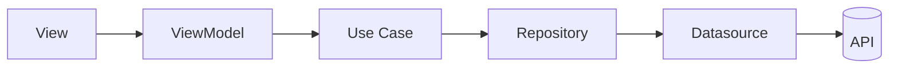
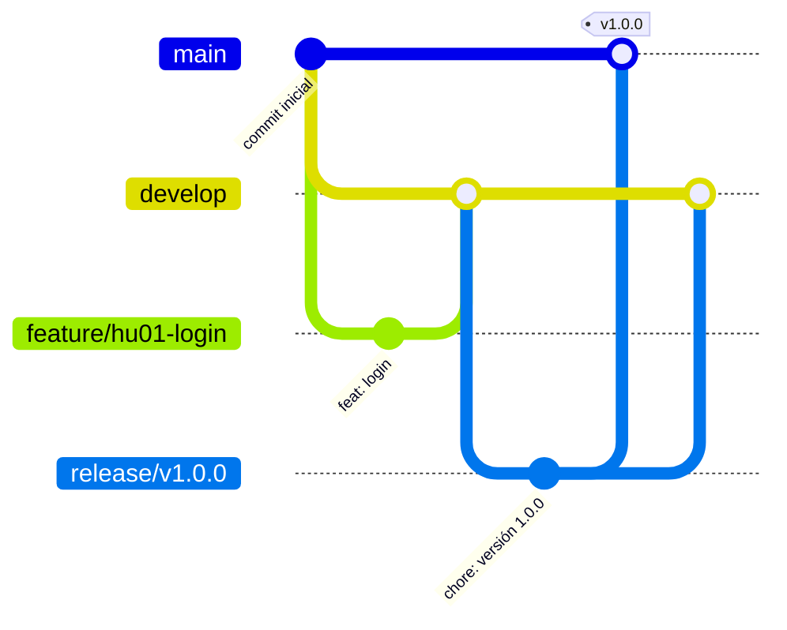

# Restaurant Management Mobile

Aplicación móvil de uso interno construida con **Expo y React Native**, con **Clean Architecture por features y MVVM**.

**Dirigida a:** Mesero · Cocina · Cajero · Administrador
**Backend:** [`restaurant-management-api`](https://github.com/IJ-Studio/restaurant-management-api)

## Contenido

[Tecnologías](#tecnologías) · [Cómo correrlo](#cómo-correrlo) · [Arquitectura](#arquitectura) · [Patrones de diseño](#patrones-de-diseño) · [Manejo de estado](#manejo-de-estado) · [Flujo de trabajo](#flujo-de-trabajo)

## Tecnologías


## Cómo correrlo

**Requisitos:** Node.js 20+, npm y la app **Expo Go** en tu celular (o un emulador Android/iOS).

```bash
git clone https://github.com/IJ-Studio/restaurant-management-mobile.git
cd restaurant-management-mobile
npm install
npx expo start
```

Escanea el código QR con Expo Go, o presiona `a` (Android) / `i` (iOS) en la terminal.

Scripts de calidad:

```bash
npm run lint   # análisis estático
npm test       # pruebas con Jest + React Native Testing Library
```

> [!NOTE]
> Las variables de entorno van en un archivo `.env` local (ignorado por Git). Usa `.env.example` como plantilla.

## Arquitectura

Clean Architecture por features + MVVM.

```text
src/
├── core/                            # Configuración, cliente HTTP e inyección de dependencias
├── shared/presentation/components/  # Componentes reutilizables
└── features/<feature>/
    ├── domain/                      # Entidades, interfaces de repositorio y casos de uso
    ├── data/                        # Datasources, DTOs, mappers e implementaciones
    └── presentation/                # Screens, componentes y ViewModels
```



- Dependencias: `presentation → domain ← data`.
- El dominio no depende de librerías de UI ni de SDKs externos.

**Referencias:** [The Clean Architecture (Robert C. Martin)](https://blog.cleancoder.com/uncle-bob/2012/08/13/the-clean-architecture.html) · [Model-View-ViewModel (Microsoft Learn)](https://learn.microsoft.com/en-us/dotnet/architecture/maui/mvvm)

## Patrones de diseño

| Patrón | Aplicación |
|---|---|
| Dependency Injection | Desacoplamiento entre capas y mocks en pruebas |
| Singleton | Comunicación con la API y autenticación |
| Adapter | Integración con servicios de pago |
| Facade | Procesos de varios pasos expuestos como una sola operación |
| Observer | Datos en tiempo real y notificaciones push |

## Manejo de estado

| Herramienta | Aplicación |
|---|---|
| Zustand | Estado local: sesión, rol y estado temporal de la interfaz |
| React Query | Datos del servidor: consulta, caché y sincronización |

## Flujo de trabajo

**Metodología:** Scrumban + XP (TDD, pair programming, integración continua)
**Control de versiones:** Gitflow · Conventional Commits



| Rama | Origen | Destino | Ejemplo |
|---|---|---|---|
| `main` | — | — | — |
| `develop` | `main` | — | — |
| `feature/hu0N-<slug>` | `develop` | `develop` | `feature/hu01-login` |
| `release/vX.Y.Z` | `develop` | `main`, `develop` | `release/v1.0.0` |
| `bugfix/<slug>` | `release/vX.Y.Z` | `release/vX.Y.Z` | `bugfix/crash-al-abrir-menu` |
| `hotfix/<slug>` | `main` | `main`, `develop` | `hotfix/token-expirado` |

> [!IMPORTANT]
> `main` y `develop` están protegidas: no hay push directo, todo entra por Pull Request con CI en verde. `main` solo recibe merges desde `release/*` y `hotfix/*`.